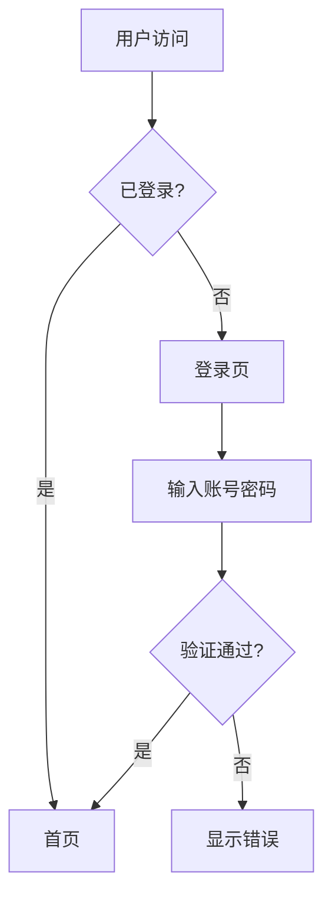

# Workflow: 编写PRD

## 触发条件
用户说：写PRD、产品文档、需求文档、功能描述、出方案

## 前置条件
- [ ] 需求已收集并确认
- [ ] 目标用户已明确
- [ ] 核心场景已梳理

## 执行步骤

### Step 1: PRD 结构规划
确定 PRD 包含的章节：
1. 背景 → 为什么做
2. 目标 → 做到什么程度
3. 用户故事 → 谁要什么
4. 功能需求 → 具体做什么
5. 非功能需求 → 做到什么质量
6. 验收标准 → 怎么算做完了

### Step 2: 编写正文（Markdown）
```markdown
# [需求标题]

## 背景
[2-3 句话：业务价值 + 用户价值]

## 目标
- [可量化的目标1]
- [可量化的目标2]

## 用户故事

### US-1: [标题]
**作为** [角色]，**我希望** [动作]，**以便** [目的]

**验收标准**：
- [ ] 标准1
- [ ] 标准2
- [ ] 标准3

## 功能需求

### F-1: [功能名称]
**描述**：[具体行为]
**规则**：
- 规则1
- 规则2

**接口**：与其他功能的交互关系

## 非功能需求
- 性能：页面加载 < 2s
- 安全：需要登录
- 兼容性：Chrome/Safari/Firefox 最新版

## 验收标准
- [ ] 所有 P0 功能可用
- [ ] 无 Critical/Major Bug
```

### Step 3: 复杂流程用 Mermaid


### Step 4: 输出 JSON（系统对接）
完成 PRD 后输出标准 JSON：

```json
{
  "requirement_title": "一句话标题",
  "requirement_description": "上面编写的完整 Markdown PRD",
  "tech_stack": {
    "frontend": "React + TypeScript",
    "backend": "Node.js + Fastify",
    "database": "SQLite",
    "deployment": "Docker"
  },
  "suggested_positions": [
    {
      "position_name": "前端工程师",
      "role": "frontend",
      "description": "负责XX页面开发",
      "reason": "项目有完整的用户界面"
    }
  ],
  "complexity": "medium"
}
```

**关键**：`requirement_description` 是纯 Markdown 字符串，不能嵌套 JSON。

## 质量检查
- [ ] 标题一句话概括需求
- [ ] 每个功能有验收标准
- [ ] 复杂流程有图表
- [ ] JSON 格式正确
- [ ] 优先级已标注
